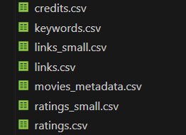
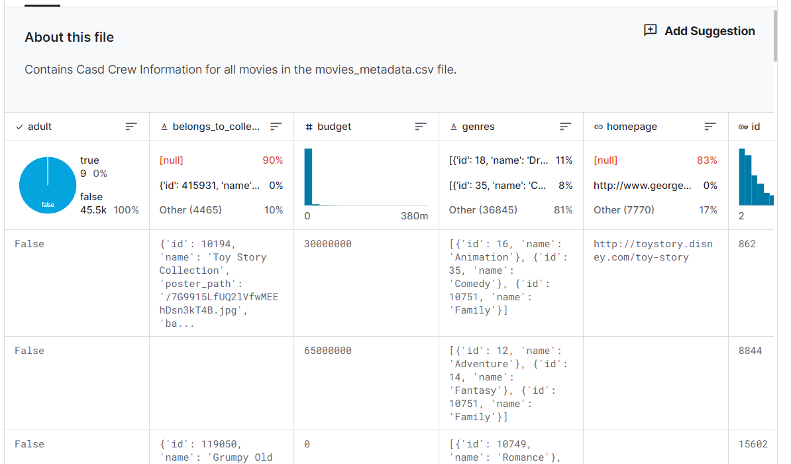
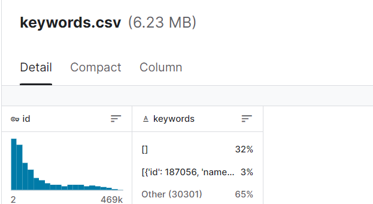
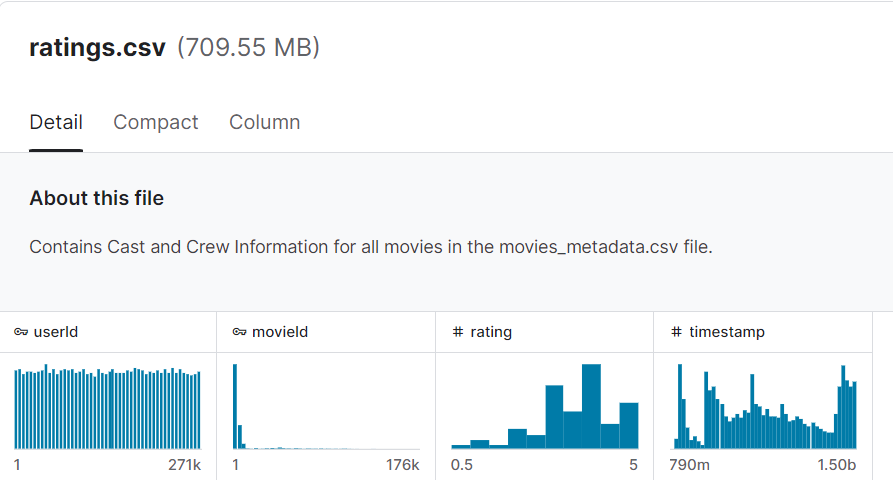

## “项目名称”进展报告

> 撰写时间：2024.4.23
>
> 撰写人：丁哲明（1120201827）、刘益鸣（1120200650）、朱天昱（1120200857）、李元盛（1120203554）、林东方（1120202925）

### 1. 数据获取及预处理

> 主要说明数据的来源，原始数据的基本情况，如数量，字段，含义等，
> 到目前为止，对数据预处理的情况，如噪声的处理，缺失值的处理等。

#### 1.1 数据来源

我们使用的数据集The Movies Dataset来自于其在kaggle平台上的官方页面https://www.kaggle.com/datasets/rounakbanik/the-movies-dataset/data 。在该页面下，中有关于数据集的描述、说明文档和详细信息。我们直接下载数据源并解压获取数据放在项目的/data文件夹下。

> 主要说明数据的来源，原始数据的基本情况，如数量，字段，含义等，
#### 1.2 数据说明

这一数据集本身是由大量电影的基本信息和网络平台上用户对于这些电影的评分信息构成。数据集由6个csv文件构成，如下图。

其中，movies_metadata.csv包含的是45000部电影的元数据，包含了数据集中电影的全部信息，记录在24个属性中。这些属性包含发布日期、语言、预算、票房乃至简介等等，数量庞大而且形式复杂。其中，部分属性（如风格、归属等）以类似于JSON键值对的形式给出，包含了一系列的子属性。

余下的4个主要数据文件结构较为简单。
credits.csv仅有三列，包含了电影ID和所有电影的制作人员信息，信息以JSON文件形式给出。keywords.csv仅有两列，包含电影ID和电影的关键词。ratings.csv有4列，其中包含了电影的评分条目信息及其时间；而links.csv有3列，给出的是电影自身ID域IMDL ID和TMDB ID的映射关系。

此外，还有两个文件links_small.csv和ratings_small.csv。它们是上述两个原数据文件的子集，从大量的电影中抽取9000个样例给出links，并在评分记录中抽出其中700个用户的100000条ratings。

数据的格式分为列、JSON、整数、浮点数、布尔值等多个类别，考虑JSON记录，数据整体结构至多有2级嵌套。

> 到目前为止，对数据预处理的情况，如噪声的处理，缺失值的处理等。
#### 1.3 数据预处理

在拿到数据之后，由于元数据文件结构复杂，我们先考虑对4个主要的数据文件进行预先处理。

在credits.csv中，有少部分电影没有给出制作人员的信息（cast和crew分别2%和5%）。在挖掘过程中，这些空条目没有实际意义，故我们将两列空缺项取并集剔除处理。

在keywords.csv中，ID完整，而关键词可能有空值（占所有记录的32%）。但实际上，电影的关键词格式并不规则，且不是必须的，因此空值可以允许。然而在实际分析过程中，空值无效，因此我们对于关键词空缺的条目做了剔除处理。

在ratings.csv中，数据项都是完整的，而评分为5分制，间隔为0.5。由于其余的三列均为整数，为了处理方便，我们将此列整体乘2，将分制改为10分制、1间隔，是的数据格式更为整齐。

在links.csv中，仅有三个整数的ID列，且所有记录都是完整的，因此暂时无需处理。

### 2. 数据分析与可视化

> 数据探索性分析的结果，可以使用统计工具，聚类分析等工具使用可视化来展示分析结果

**电影类型与平均评分**：分析了电影的各种类型与评分的对应关系，可以看到各类型电影的平均评分都相差不大，基本都在5~6分。其中，Animation类型和History类型的评分位列前两名。Animation类型评分最高，可能是因为动画类的电影较为有趣，容易吸引观众。History类型的评分排名第二，可能是因为大部分历史题材的电影基于人们感兴趣的历史事件，且制作很精良，能激发观众共鸣。

**各类型电影数量随时间变化**：分析了各种类型的电影的数量与年份的对应关系，可以看到随着年份增大，电影总体数量也一直在增加，其中Drama、Comedy、Thriller三类是最近几年数量最多的电影类型。

**电影类型与票房**：分析了电影的类型与票房随年份的对应关系，可以看到随着年份增大，各类电影的票房也一直在增加，其中Adventure、Action两类是票房最多的电影类型。但这两个类型既不是数量最多的电影，也不是评分最高的电影，因此可以看出这两类电影较受欢迎，即使电影的评分不够高（可能是剧情、质量不够高），但仍然能够获得较大的收入。

**不同年份不同类型电影的评分**：分析了电影的不同年份中各类电影的评分，可以看到Animation、History、Music、War几种类型的电影的评分一直处于较高水平。

### 3. 模型选取

> 围绕选题要解决的问题，考虑使用哪些模型来进行挖掘
> 说明选择的理由

- 导演和演员如何影响电影的评分和票房？

考虑对导演和演员的影响力做量化分析，进而通过建立回归模型探究两者对评分和票房的影响

- 电影的预算和票房之间有何关联？

考虑直接采用简单回归模型。

- 随着时间的推移，电影产业有哪些变化？

主要关注电影票房随时间的变化，该数据集规模较小，且票房随时间的变化具有一定的周期性、平稳性。考虑采用ARIMA模型。

- 用户的评价行为有何模式？

考虑进行相关性分析，分析用户评价指标与票房、演员、导演之间的相关性。

### 4. 挖掘实验的结果

暂无

### 5. 系统交互设计

本项目的功能如下：
- 数据清洗：软件可以对数据进行清洗，删除不合格或缺失的数据，确保分析的准确性。
- 数据挖掘：利用先进的算法进行数据挖掘，对电影数据进行深度分析。
- 可视化：能够以图表的形式展示挖掘结果，如电影票房的趋势、电影类型的分布等。

使用方法：软件打开后，首先会进入一个导入数据的界面。用户需要将电影数据集文件导入到软件中。在主界面中，用户可以选择你想要执行的数据分析操作。例如，可以选择显示电影票房的趋势图表，或分析电影类型的分布。当选择好操作后，点击执行按钮，软件将进行数据分析并生成结果。

输入：需要输入的主要是电影数据集，以及用户的交互指令

输出：输出的主要是数据分析的结果，可能是图表、报告或电影推荐等。

### 6. 存在的问题

在项目执行过程中，我们遇到了一系列问题，特别是在回归模型和相关性分析的执行中。以下是我们发现并正在努力解决的主要问题：
- 数据收集问题：虽然我们已收集了一些数据，但由于各种原因，包括缺乏统一标准、传播渠道的多样性、电影票房及评分数据的动态性等， 导致我们所需要的真实、准确和完整的数据难以获得。投入大量的时间和资源精准收集和处理这些数据，有可能会影响项目的进度。
- 影响因素过多：在分析导演和演员对电影评分和票房的影响时，由于影响这些变量的因素较多，例如电影类型、发行时间、竞争环境等，而这些都可能影响到最后的模型结果，为确定最影响电影评分和票房的关键因素带来了挑战。
- 模型选择问题：尝试用简单回归模型来探究电影预算和票房之间的关联，但出现了欠拟合的情况。这可能是因为单一预算因素往往不能很好地解释票房，我们可能需要导入更多其他因素来建立一个更有效的模型。
- 数据周期性和平稳性不足：在尝试采用ARIMA模型预测随着时间推移，电影产业的变化时，发现数据的周期性和平稳性不是很显著。这可能会导致预测结果的准确度受到影响。
- 评价行为的多元性：关于用户评价行为的模式，评价的指标不仅包括了演员、导演和票房，同时还包括了用户个人喜好、观影环境等因素。所有这些都让用户评价行为的相关性分析变得异常复杂，难以得出高度精准的分析结果。

### 7. 下一步工作

1. 继续分别完成数据挖掘代码、前端代码、后端代码的编写；
2. 完成所有代码的联调，解决Bug；
3. 完成文档编写。

### 8. 任务分配与完成情况
任务分配如下：
- 丁哲明：数据挖掘——前端代码、数据挖掘——库和可视化
- 刘益鸣：数据挖掘——库和可视化、文档编辑
- 朱天昱：数据准备、数据挖掘——后端代码
- 李元盛：数据挖掘——后端代码、文档编辑
- 林东方：需求分析、数据挖掘——前端代码

完成情况如下：
- 需求分析：100%
- 数据准备：100%
- 数据挖掘代码编写：60%
- 前端代码编写：50%
- 后端代码编写：50%
- 可视化代码编写：20%
- 文档编写：0%